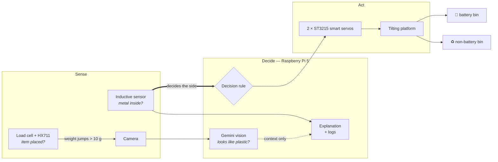
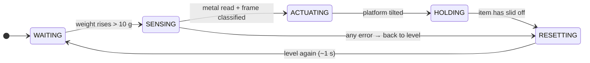

<div align="center">

# ♻️🔋 SortiFy

### Catching hidden batteries *before* they reach the recycling truck.

**SortiFy scans waste for hidden batteries using sensors; it flags and reroutes them before they can cause harm — protecting recycling facilities and waste bins from the hazards posed by lithium batteries.**

[](https://devpost.com/software/sortify-fbow2t)
[](https://devpost.com/software/sortify-fbow2t)


</div>

---

## The problem

Vapes, earbuds, toys, greeting cards that sing — more and more of what we throw away has a **lithium-ion battery sealed inside it**. When those cells get crushed in a garbage truck or a sorting line they ignite, and the result is thousands of reported fires at recycling and waste facilities every year.

The catch is that these items **look like ordinary plastic**. A person glancing at a bin can't tell. Neither can a camera. By the time anyone finds out, the item is already in the compactor.

Most solutions work downstream, at the facility. **SortiFy works at the source — the moment you throw something away.**

## What it does

Drop an item on the platform. In a few seconds SortiFy:

1. **notices it** — a load cell feels the weight land,
2. **looks at it** — a camera frame goes to Google's Gemini, which says what the item appears to be made of,
3. **looks *inside* it** — an inductive sensor under the platform checks for metal that no camera could see,
4. **decides** — and the platform physically tilts the item into one of two bins:

| | Bin | What lands here |
|---|---|---|
| 🔋 | **Battery side** | Anything with metal detected in it — routed to e-waste |
| ♻️ | **Non-battery side** | No metal detected — safe for the normal stream |

Then it levels out and is ready for the next item roughly a second later.

### The idea in one sentence

> **A camera sees the outside. An inductive sensor sees the inside. The interesting moment is when they disagree.**

When Gemini says *"that's plastic"* and the sensor says *"there's metal in there"*, you are very probably holding a vape, a toy or a pair of earbuds — and SortiFy says so:

```
sensed: metal_present=True plastic=True -> side=battery
        [looks like plastic but metal detected inside - possible hidden battery]
```

## How it works



The whole thing is one explicit state machine ([`sorter/main.py`](sorter/main.py)):



### The decision rule — and why the AI doesn't get the final say

```python
def sort_side(plastic: bool, metal_present: bool) -> str:
    return BATTERY_SIDE if metal_present else NON_BATTERY_SIDE
```

That's the entire rule, and it is short on purpose.

- **The inductive sensor alone decides where an item goes.** Metal detected → battery side. No two ways about it.
- **Gemini never moves an item.** A camera can't see inside anything, so vision is never allowed to put an item on the battery side by itself — and it can never talk an item with metal in it *out* of the battery side. Nothing in the code "assumes" a battery.
- **What Gemini adds is meaning.** Metal + *looks like plastic* is the case this machine exists to catch, and that is the explanation it logs. Metal + *looks like a can* is just a can.
- **If the API is slow, down, or returns junk** (we hit real `503 model overloaded` errors during the hackathon), the classifier returns a result that claims nothing and the item is *still sorted correctly* — the sensor reading was all the rule needed.

A generative model is what made recognising arbitrary household waste possible in a weekend: no dataset, no training, just a prompt and an enforced JSON schema. Keeping it out of the safety-critical path is what makes the machine trustworthy.

## Hardware

| Part | Job | Notes |
|---|---|---|
| **Raspberry Pi 5** (Ubuntu 24.04) | Runs everything | One Python process |
| **Camera** | Frame for Gemini | OpenCV capture |
| **LJ18A3-8-Z/BX inductive sensor** | Metal yes / no | NPN, open collector, active-low on GPIO17 |
| **Bar load cell + HX711** | "An item was placed" | Bit-banged over two GPIOs |
| **2 × Feetech ST3215 smart servos** | Tilt the platform | 12 V, 30 kg·cm, 12-bit absolute encoders, serial bus |
| **3D-printed frame, platform, legs, camera mount** | The machine itself | Designed in Autodesk Inventor — STEP files in this repo |

### Wiring (Raspberry Pi 5 header)

| Pi pin | GPIO | Connects to |
|---|---|---|
| 8 | GPIO14 (TX) | Servo data line, **through a 1 kΩ resistor** |
| 10 | GPIO15 (RX) | Servo data line, directly |
| 11 | GPIO17 | Inductive sensor signal (black wire) |
| 29 | GPIO5 | HX711 `DT` |
| 31 | GPIO6 | HX711 `SCK` |
| 17 | 3.3 V | HX711 `VCC` |
| 6, 9, 25 | GND | Common ground — servos, supply −, both sensors |

The servos run from their own 12 V supply. **Battery/supply positive never touches the Pi.**

## The engineering, honestly

The Devpost says *"physical faults lacked error logs."* Here is what that looked like in the small hours, and what we built because of it.

**We threw away the servo controller board and talked to the servos directly.**
Our USB bus-servo adapter never produced a single reply — not from a laptop, not from the Pi, not with a known-good servo. So we removed it. The ST3215 speaks half-duplex serial at 1 Mbps on one wire; [`sts_bus.py`](sorter/actuators/sts_bus.py) implements that protocol from scratch over the Pi's own UART, with TX and RX tied to the data line through a single resistor. The servos answered on the first try.

**The echo trap.** On a one-wire bus you hear everything you say. Vendor SDKs mistake that echo for the servo's reply — so they cheerfully "find" a servo at every ID, including with nothing plugged in. Our driver reads back and verifies its own echo, which turns a nuisance into a free wiring self-test with three *different* errors instead of one useless timeout:

| Error | What it means |
|---|---|
| `BusWiringError` | We spoke and heard nothing — RX isn't on the wire |
| `BusContentionError` | We heard something we didn't say — a short, or a second driver |
| `ServoTimeout` | Echo perfect, servo silent — it's the servo's power, cable or ID |

**Two servos, one mechanism, facing opposite ways.** [`ServoPair`](sorter/actuators/servo_pair.py) sends both goals in a single sync-write packet so they start in the same instant. Calibration is done by hand, not by maths: torque off, move the platform to level and to each end, and [`read_positions.py`](sorter/tests/read_positions.py) records each servo's own encoder value — detecting by itself which servo is mirrored. No kinematics, no invert flags.

**Three layers between a bug and a broken platform.** Travel limits are written into each servo's EEPROM, so the *servo* refuses to go past them whatever the code asks for. Setpoints sit a further margin inside those limits, so overshoot never reaches them. And torque is capped in config.

**An HX711 that doesn't lie.** That chip treats a clock pulse longer than 60 µs as "power down" — and Python on Linux can be pre-empted mid-pulse. [`hx711.py`](sorter/sensors/hx711.py) drives the pins through `lgpio` directly (~4 µs a pulse), times every pulse, and throws away any reading that was disturbed instead of trusting it. A dead data line is reported as `HX711StuckLow` rather than as a very confident zero grams.

**Weight as a *change*, not a number.** The scan starts when the weight *rises* more than 10 g above a resting level that is re-measured after every dump and follows slow drift. The scale's zero never has to be right — which matters when a load cell gets swapped halfway through a hackathon.

**It all runs without the hardware.** Every device sits behind a mock, and the hardware logic is tested against simulated servos, a simulated HX711 and gpiozero's mock pins — **165 tests**, runnable on a laptop. That is how a team writes code against a single rig.

## Run it

```bash
git clone https://github.com/marcuskongjika/htn-2026.git
cd htn-2026/sorter
python3 -m venv .venv && source .venv/bin/activate
pip install -r requirements.txt
cp .env.example .env          # add GEMINI_API_KEY; MOCK_HARDWARE=1 on a laptop, 0 on the Pi
```

| Command | What it does |
|---|---|
| `python main.py` | The full sorter. A weight landing on the platform starts each scan |
| `python main_enter.py` | Same pipeline, but **Enter** starts each scan — no load cell needed |
| `python -m pytest tests -q` | 165 tests, no hardware required |
| `MOCK_HARDWARE=1 python main.py --cycles 1` | One full cycle on a laptop, nothing attached |

### Bring-up and diagnostic tools

Every one of these exists because something broke. The ones that move hardware ask first.

| Tool | Use it when |
|---|---|
| `python -m actuators.sts_bus scan` | "Are the servos alive?" — IDs, position, voltage, temperature, limits |
| `python -m actuators.sts_bus loopback` | Prove the UART and the TX/RX tie before a servo is even connected |
| `python tests/read_positions.py` | Calibrate: move the platform by hand, record level / min / max, save |
| `python -m actuators.calibration apply` | Write the travel limits into the servos' EEPROM |
| `python tests/goto_setpoints.py` | Drive the platform to level / battery / non_battery and nothing else |
| `python tests/sensor_tilt_loop.py` | Metal sensor → platform, without the camera or the API |
| `python tests/load_cell_read.py` | Live scale readout; tare, calibrate against a known weight, save |
| `python tests/gpio_check.py` | "Is it the Pi pin, the jumper wire, or the board?" — answers exactly that |

Full setup, wiring and bring-up order: **[`sorter/README.md`](sorter/README.md)**.

## Repository

```
htn-2026/
├── sortify_*.stp                 CAD — platform, base, legs, floor, camera mount (STEP)
└── sorter/
    ├── main.py                   state machine, load-cell triggered
    ├── main_enter.py             same pipeline, Enter triggered
    ├── config.py                 every pin, threshold, margin and timing in one place
    ├── logic/decision.py         the sorting rule (it's one line)
    ├── vision/                   camera capture + Gemini classifier
    ├── sensors/                  hx711 driver, load cell, inductive metal sensor
    ├── actuators/
    │   ├── sts_bus.py            ST3215 protocol over the Pi's UART, from scratch
    │   ├── servo_pair.py         two servos as one mechanism
    │   └── calibration.py        measured zero / travel / mirroring, shared everywhere
    ├── tests/                    165 tests + the physical bring-up tools
    └── *_calibration.json        what we measured on the rig
```

## What we learned

- **Details decide whether a system works.** A pin one position over, a resistor on the wrong leg, a jumper that *looks* seated.
- **Test components early and alone.** Every part that was proven by itself before integration cost us minutes. Every part that wasn't cost us hours.
- **Hardware and software fail differently.** Software tells you what went wrong. Hardware just stops — so we made the software say *which side of the wire* to look at.
- **Calibrate against real objects, not assumptions.** The servos' limits, the scale's counts-per-gram, the sensor's range: every number in this repo that matters was measured on the rig.

## What's next

- **More categories** — plastics, metals, glass, paper, each to its own stream
- **Broader sensing** — more item types, more robust detection of pouch cells
- **Bigger installations** — campuses, airports, offices
- **Contamination insights** — give facilities data on what is actually being thrown away, and where

## Team

Built over one weekend at **Hack the North 2026** by

**Sharisse Ji** · **[Zhi Wei Zhang](https://www.linkedin.com/in/zhiweizhang27)** · **Andrii Bessarab** · **Marcus Kongjika**

<div align="center">

**[▶ See SortiFy on Devpost](https://devpost.com/software/sortify-fbow2t)**

*Built with Python, Google Gemini and Autodesk Inventor.*

</div>
